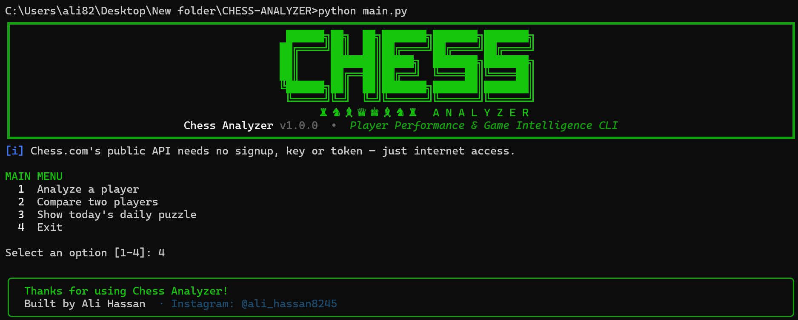
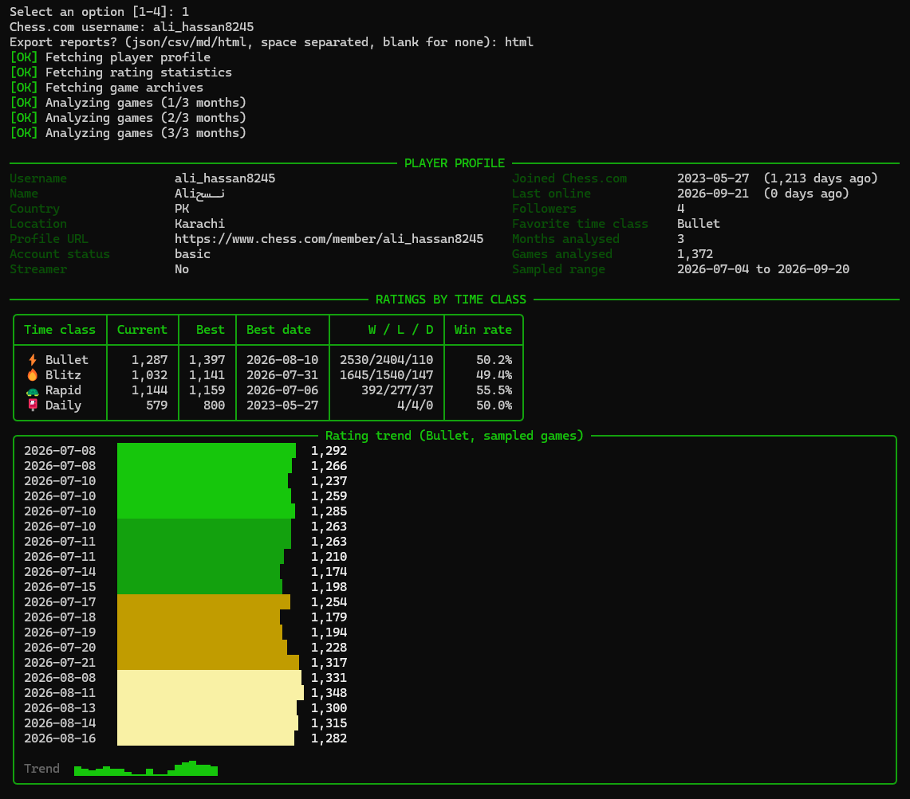
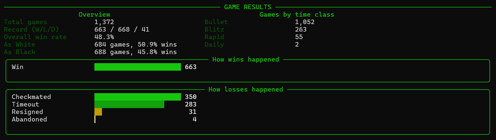
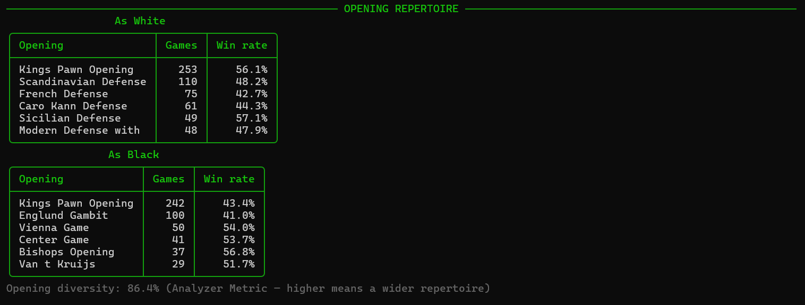
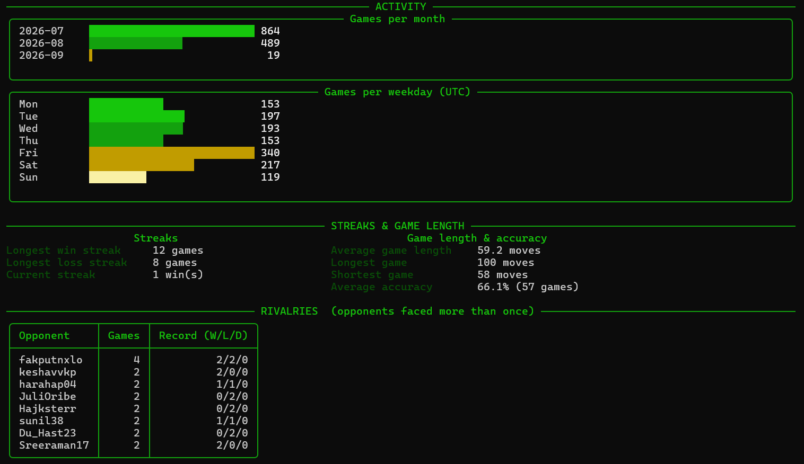
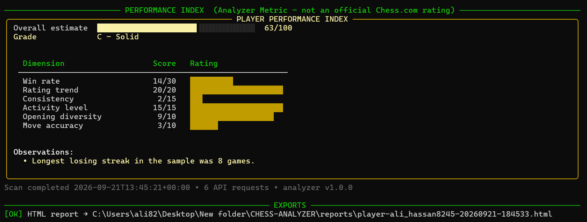
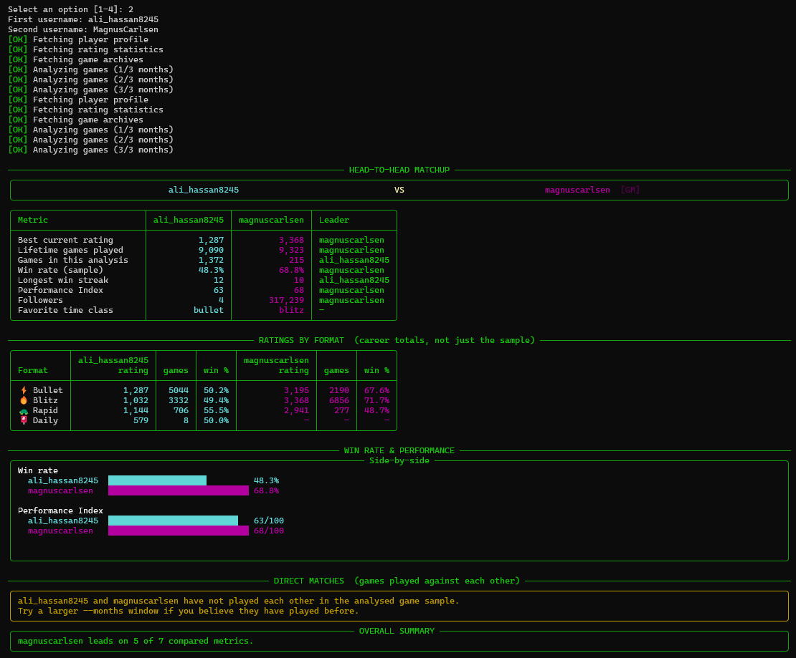
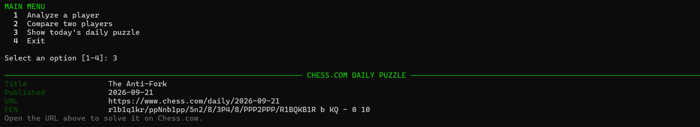
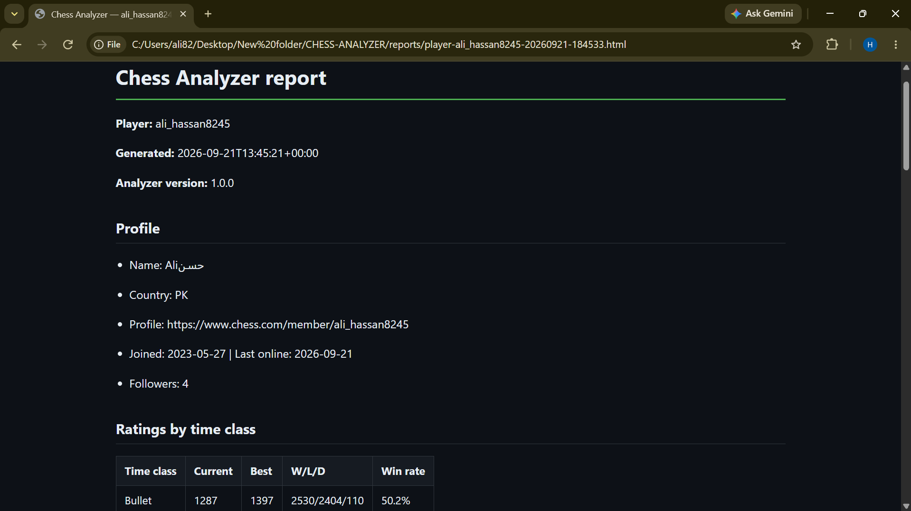

# Chess Analyzer

A professional command-line tool that analyses **Chess.com players and their games**
using Chess.com's official Published-Data API, and renders the results as a rich
terminal dashboard.

No web server. No browser. No database. No Docker. **No signup, no API key, no
token of any kind** — Chess.com's public API is completely open.
Just **Python + internet + `pip install -r requirements.txt`**.

<!-- SCREENSHOT 1 — BANNER + MAIN MENU
     Run: python main.py
     Capture the ASCII banner and the main menu. This is the hero image. -->



---

## Table of contents

- [Features](#features)
- [Requirements](#requirements)
- [Installation](#installation)
- [Usage](#usage)
- [No token needed](#no-token-needed)
- [Screenshots](#screenshots)
- [Reports](#reports)
- [Analyzer Metrics](#analyzer-metrics)
- [Project structure](#project-structure)
- [Tests](#tests)
- [Troubleshooting](#troubleshooting)
- [Limitations](#limitations)
- [License](#license)

---

## Features

### Player profile

- Username, title (GM/IM/FM/etc.), name, country, location, account status
- Account age, last online, followers, streamer status

### Ratings

- Current and best rating for every time class (Bullet, Blitz, Rapid, Daily)
- Win/loss/draw record and win rate per time class
- **Rating trend chart** built directly from the sampled games — no separate
  rating-history endpoint exists, so this tool reconstructs it game by game

### Game results

- Overall win/loss/draw record and win rate
- Performance split by color (White vs Black)
- Games broken down by time class
- **How wins/losses happened** — checkmate vs resignation vs timeout vs draw type

### Opening repertoire

- Top openings played as White and as Black, with per-opening win rate
- **Opening diversity score** (Analyzer Metric) — how varied a repertoire is

### Activity

- Games played per month
- Games played per weekday (UTC)

### Streaks & game length

- Longest win streak, longest loss streak, current streak
- Average / longest / shortest game length in moves
- Average move accuracy (when Chess.com's Game Review has computed it)

### Rivalries

- Head-to-head record against every opponent faced more than once in the sample

### Performance Index

- A 0–100 score with a coloured gauge and letter grade, combining win rate,
  rating trend, consistency, activity, opening diversity and accuracy

### Comparison

A full head-to-head matchup between two players, not just a metrics table:

- Career ratings and lifetime games played, broken down **by format** (Bullet,
  Blitz, Rapid, Daily) — not just a single number
- Win rate and Performance Index shown as **side-by-side bar charts**
- **Direct match record** — if the two players have faced each other in the
  analysed sample, their actual head-to-head score (wins/losses/draws) is
  shown with a winner declared; if they've never played each other, the tool
  says so plainly instead of guessing
- An overall summary declaring who leads on the most metrics

### Bonus

- **Daily puzzle** — fetches and displays Chess.com's puzzle of the day

### Exports

JSON, CSV, Markdown and self-contained HTML reports, plus optional PNG charts.

---

## Requirements

- Python 3.9 or newer
- An internet connection
- **Nothing else.** No account, no API key, no token.

---

## Installation

```bash
git clone https://github.com/alihassanazad8245/CHESS-ANALYZER.git
cd CHESS-ANALYZER
python -m venv .venv
```

Activate the virtual environment.

**Windows (PowerShell / CMD):**

```bash
.venv\Scripts\activate
```

**Linux / macOS:**

```bash
source .venv/bin/activate
```

Install the dependencies and run:

```bash
pip install -r requirements.txt
python main.py
```

---

## Usage

### Interactive mode

```bash
python main.py
```

You get a menu:

```
1  Analyze a player
2  Compare two players
3  Show today's daily puzzle
4  Exit
```

### Direct mode

```bash
# Analyse a player (last 3 months of games by default)
python main.py --player ali_hassan8245

# Analyse more history
python main.py --player MagnusCarlsen --months 6

# Only look at one time class
python main.py --player ali_hassan8245 --time-class blitz

# Compare two players
python main.py --compare ali_hassan8245 MagnusCarlsen

# Export reports and PNG charts
python main.py --player ali_hassan8245 --format json md html --charts

# Today's daily puzzle
python main.py --puzzle
```

### All options

| Option | Description |
| --- | --- |
| `--player`, `-p` | Chess.com username to analyse |
| `--compare`, `-c` | Compare two Chess.com players |
| `--puzzle` | Show today's Chess.com daily puzzle and exit |
| `--months`, `-m` | Number of recent months of games to analyse (default: 3) |
| `--time-class` | Only analyse `bullet`, `blitz`, `rapid`, `daily`, or `all` (default: all) |
| `--format`, `-f` | Export formats: `json`, `csv`, `md`, `html` (space separated) |
| `--output`, `-o` | Output directory for reports (default `./reports`) |
| `--charts` | Also export PNG charts (requires `matplotlib`) |
| `--no-color` | Disable coloured output |
| `--verbose`, `-v` | Verbose logging and full tracebacks |
| `--version` | Print the version and exit |
| `--help`, `-h` | Show help and exit |

---

## No token needed

Unlike most APIs, **Chess.com's Published-Data API requires absolutely nothing**:

- No signup
- No API key
- No OAuth
- No rate-limit quota to manage

The only thing Chess.com asks is that requests are made **one at a time, not in
parallel** — this tool already does that by design, so you will never need to
configure anything. If you ever see a rate-limit message, it just means requests
arrived too close together; wait a few seconds and try again.

This also means there is no `.env` file, no `GITHUB_TOKEN`-style setup, and no
"how do I get a key" step. Clone it and run it.

---

## Screenshots

### Player profile and ratings

<!-- SCREENSHOT 2 — Run: python main.py --player ali_hassan8245
     Capture PLAYER PROFILE and RATINGS BY TIME CLASS, including the rating trend chart. -->



### Game results

<!-- SCREENSHOT 3 — Same command.
     Capture the GAME RESULTS section, including "how wins/losses happened". -->



### Opening repertoire

<!-- SCREENSHOT 4 — Same command.
     Capture the OPENING REPERTOIRE tables for White and Black. -->



### Activity and streaks

<!-- SCREENSHOT 5 — Same command.
     Capture ACTIVITY (monthly/weekday charts) and STREAKS & GAME LENGTH. -->



### Performance Index

<!-- SCREENSHOT 6 — Same command.
     Capture the PERFORMANCE INDEX panel with the coloured gauge. -->



### Player comparison

<!-- SCREENSHOT 7 — Run: python main.py --compare ali_hassan8245 MagnusCarlsen
     Capture the VS header, the metrics table, the ratings-by-format table,
     the win-rate bars, and the head-to-head record panel. You may need two
     screenshots (07a and 07b) if it doesn't fit on one screen — rename the
     file below to match whichever you use. -->



### Daily puzzle

<!-- SCREENSHOT 8 — Run: python main.py --puzzle
     Capture the CHESS.COM DAILY PUZZLE panel. -->



### Exported HTML report

<!-- SCREENSHOT 9 — Run with --format html, then open the file from reports/ in a browser.
     Capture the rendered page. -->



---

## Reports

Exported files land in `reports/` (override with `--output`):

```
reports/
    player-ali_hassan8245-20260920-093709.json
    player-ali_hassan8245-20260920-093709.md
    player-ali_hassan8245-20260920-093709.html
    player-ali_hassan8245-20260920-093709.csv
    ali_hassan8245-rating-trend.png
    ali_hassan8245-results.png
    ali_hassan8245-openings.png
    ali_hassan8245-activity.png
```

| Format | Use it for |
| --- | --- |
| **JSON** | The complete structured report, ideal for further processing |
| **CSV** | A flat `field,value` table for spreadsheets |
| **Markdown** | Readable summary, good for pasting into an issue or a wiki |
| **HTML** | A self-contained page with light and dark styling — open it in any browser |
| **PNG** | Optional charts, rendered headlessly (`pip install matplotlib`) |

---

## Analyzer Metrics

Some values are **computed by this tool**, not supplied by Chess.com. They are
always labelled `Analyzer Metric` in the terminal and in exported reports:

- **Performance Index** (0–100 with a letter grade) — combines win rate, rating
  trend, consistency, activity, opening diversity and accuracy
- **Opening diversity score** — how varied a player's opening choices are
- **Rating trend chart** — reconstructed from the sampled games' per-game
  ratings, since Chess.com does not publish a rating-history endpoint

These are heuristics based on public game data. They are useful for tracking
progress and comparing players, but they are **not official Chess.com ratings**.

---

## Project structure

```
CHESS-ANALYZER/
├── main.py                  # entry point: python main.py
├── requirements.txt         # dependencies
├── pytest.ini               # test configuration
├── .gitignore
├── README.md
├── LICENSE
├── reports/                 # generated output (git-ignored)
├── tests/
│   └── test_analyzer.py     # offline test suite
└── chess_analyzer/
    ├── __init__.py          # version and app metadata
    ├── __main__.py          # python -m chess_analyzer
    ├── cli.py               # arguments, interactive menu, orchestration
    ├── config.py            # settings and API limits (no token to manage)
    ├── errors.py            # typed exceptions for friendly error messages
    ├── chess_client.py      # Chess.com Published-Data API client
    ├── analyzer.py          # analysis engine (no I/O, no rendering)
    ├── models.py            # typed report containers
    ├── ui.py                # terminal rendering and charts
    ├── reports.py           # JSON / CSV / Markdown / HTML exporters
    ├── charts.py            # optional PNG charts
    └── utils.py             # PGN parsing, opening extraction, formatting
```

### Files you are most likely to change

| File | Change it to… |
| --- | --- |
| `chess_analyzer/config.py` | adjust `DEFAULT_MONTHS`, `MAX_MONTHS`, timeouts |
| `chess_analyzer/analyzer.py` | change Performance Index weights or add an analysis |
| `chess_analyzer/ui.py` | restyle the dashboard, banner, colours, chart widths |
| `chess_analyzer/reports.py` | change report layout or add an export format |
| `chess_analyzer/utils.py` | tune opening-name grouping or result classification |
| `chess_analyzer/cli.py` | add a command-line flag or a menu entry |

---

## Tests

```bash
pip install pytest
pytest
```

51 tests covering username validation, PGN header parsing, move counting,
opening-name extraction, result classification, HTTP error mapping, every
analysis function, report generation in all four formats, HTML escaping,
path-traversal safety and CLI argument parsing.

The suite is **fully offline** — the HTTP layer is faked with realistic
payloads matching Chess.com's documented API schema — so it runs in under a
second and never makes a real network call.

---

## Troubleshooting

**`ModuleNotFoundError: No module named 'rich'`**
Dependencies are not installed, or the virtual environment is not active.
Run `pip install -r requirements.txt`.

**`Chess.com player 'x' was not found`**
Check the exact spelling of the username shown on their Chess.com profile page.
Usernames are case-insensitive but must exist exactly.

**`Chess.com throttled this request (429)`**
This happens if requests arrive too close together. Wait a few seconds and
try again — there's no quota to configure, this is purely about timing.

**`Could not reach api.chess.com`**
Check your internet connection and any proxy or firewall blocking HTTPS
traffic. If you're running this inside a sandboxed or restricted network
environment, make sure `api.chess.com` is allowed through.

**PNG charts are not generated**
`matplotlib` is optional. Run `pip install matplotlib` and re-run with `--charts`.

**Boxes and bars look broken**
Your terminal font lacks Unicode box-drawing characters. On Windows use Windows
Terminal rather than the legacy console, or run with `--no-color`.

**A player has no rating shown for some time classes**
Chess.com only returns a stats block for game types the player has actually
played. If someone has never played Bullet, no Bullet row appears — that's
expected, not a bug.

---

## Limitations

- Game analysis is based on a sample of the most recent months (`--months`,
  default 3, capped at 24), not the player's entire history. Chess.com's API
  has no cap on how much you *can* request, but pulling years of archives for
  every analysis would be slow — sampling keeps it fast.
- Move accuracy is only available for games where Chess.com's Game Review
  has already computed it; older or less prominent games often lack this data.
- "Average game length" is estimated by counting move numbers in the PGN
  move text, not by parsing the full game — a lightweight but reliable proxy.
- Opening names are derived from Chess.com's ECO opening URL and grouped into
  families; very obscure or transposed openings may be grouped broadly.
- The Performance Index is a heuristic produced by this tool, not a Chess.com
  rating, and should not be compared to official Elo/Glicko ratings.
- Chess variants (Chess960, bughouse, king-of-the-hill, three-check) are
  excluded from game analysis to keep statistics meaningful for standard chess;
  skipped games are counted and reported in the notes panel.

---

## License

Released under the MIT License. See [LICENSE](LICENSE).

---

Built by **Ali Hassan** — [GitHub](https://github.com/alihassanazad8245) · [Instagram](https://instagram.com/ali_hassan8245)
